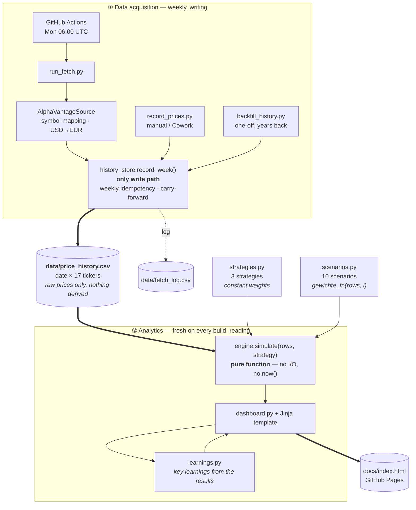

# Börsenspiel – Barbell Portfolio Dashboard

**📊 Dashboard:** [s540d.github.io/Boersenspiel](https://s540d.github.io/Boersenspiel/)

Virtual portfolio following a barbell strategy, based on the requirements
document `Pflichtenheft_PortfolioProjekt_v2.md` (deliberately **not** part of
this repository, see note below). The technical implementation intentionally
deviates from that document in a few places (see
[Deviations from the requirements](#deviations-from-the-requirements) below):
weekly instead of daily price fetching, CSV persistence in the Git repo
instead of a Google Sheet, output as a static dashboard on GitHub Pages.

## The portfolio

Every strategy and scenario draws from the same 17 instruments defined in
`instruments.py`; which of them a given strategy actually holds, and at what
weight, is decided separately in `strategies.py`. Two buckets recur in every
strategy:

- **Bucket A – Safety**: broad, low-volatility instruments — a global bond
  ETF and physical gold. Always the smaller half of the barbell (20% or 30%,
  depending on the strategy).
- **Bucket B – Growth**: broad, diversified equity exposure — a global
  equity ETF, a Nasdaq-100 ETF, a semiconductor-sector ETF, an
  emerging-markets ETF, and Bitcoin. The larger half of the barbell (80%, or
  60% in the strategy described next).

One strategy, `Barbell 20/60/20 + Single-Stock Satellite`, adds a third
bucket, **Bucket C – Single-Stock Satellite**: 10 equally-weighted individual
stocks instead of broad ETFs. "Satellite" here follows the common
core-satellite terminology from portfolio construction — a smaller,
concentrated, higher-conviction (and higher-volatility) allocation held
alongside a diversified "core", not a synonym for "additional" or "extra".
The 20 percentage points for it come out of Bucket B, so the overall risk
profile (80% risky / 20% safe) stays the same as in `Barbell 20/80` — only
the growth side becomes more concentrated. The 10 stocks deliberately mix
highly volatile growth/thematic names (Lumentum, BYD, SolarEdge, SMA Solar,
Tesla, Palantir, Strategy/formerly MicroStrategy, Rivian) with two defensive
blue chips (Coca-Cola, Roche) as a counterexample — a first pass, not an
optimized or backtested selection.

## Architecture

The project splits into two halves that only touch each other through a CSV
file: a **writing** half that fetches prices, and a **reading** half that
computes analytics from them.



### Process overview

**① Data acquisition.** Once a week, the workflow fetches a price for each of
the 17 tickers. Everything source-specific — Alpha Vantage symbols, the
USD→EUR conversion of the satellite stocks, the dedicated crypto endpoint —
stays inside `sources/`. The result is always the same: one `PriceQuote` per
ticker. Which provider delivered the price is no longer visible, or relevant,
after that point.

`history_store.record_week()` is the only way into the CSV. It keys off the
**ISO calendar week**, not the calendar date: a second run in the same week
updates the existing row instead of appending a duplicate. If a price is
missing, the last known price is carried forward (carry-forward) and noted in
`fetch_log.csv` — the row is never left with a gap. Which row a price belongs
to is decided by the **trading day** reported by the source, not the day of
the fetch: a Monday-morning run before the market opens returns Friday's
closing price from the previous week, and that belongs in Friday's week.

**Only the raw price is persisted.** No position values, no share counts, no
tax state. That is the project's central design decision: everything derived
is recomputed on every evaluation.

**② Analytics.** `engine.simulate(price_history, strategy)` receives the
complete price history and a strategy, and computes the entire portfolio
development from week one onward — initial purchase, rebalancing, fees, loss
offsetting, tax allowance, tax. No I/O, no `datetime.now()`, no state beyond
the call. Nothing is carried forward incrementally, everything is recomputed.
That is what guarantees determinism: identical price history + identical
strategy ⇒ guaranteed identical result.

Because the simulation costs nothing but compute time, `build_dashboard.py`
can run it as often as it likes — once per strategy and scenario, all against
the same price history, placing the results side by side.

**③ Key learnings.** At the very top of the dashboard sits a section that
puts the most notable findings from the comparison into words. It, too, is
**derived, not stored**: `learnings.py` only holds the *question* for each
learning, as a pure function `(views) -> Learning | None` — how wide is the
gap between the best and worst rule, where does the rule with the most trades
land in the ranking, what do fees and tax cost, how many sub-rules of a
composite strategy contribute negatively. All numbers *and* all superlatives
("biggest drag", "sole anchor") come from the current results. If the price
history changes, the statements change with it; if a question cannot be
answered from the available data (e.g. because only one strategy is
rendered), the rule returns `None` and the learning silently disappears
instead of inventing a claim.

### Strategies, scenarios, and what cuts across them

A **strategy** is a target weighting across instruments, grouped into
buckets. A **scenario** is the same data structure with an additional field
`gewichte_fn(rows, i)` — the weights are then no longer constant but
determined anew for each price row (seasonal, chart-based, momentum-driven,
…). For the engine this makes no difference: it calls the function and
rebalances toward whatever comes back. It does not know a single rule by
name.

Three properties that are easy to miss:

- **Scenarios are fully independent of one another.** Every run starts at
  week 0 with the full starting capital and only ever sees its own
  `gewichte_fn`. There is no shared state, no ordering, no interaction — the
  runs could happen in any order or in parallel.
- **Scenarios only use part of the data.** All scenarios in `scenarios.py`
  build on the buckets of `Barbell 20/80` and therefore only touch **7 of the
  17** tickers; the 10 satellite stocks appear only in
  `Barbell 20/60/20 + Single-Stock Satellite`. The price history is
  deliberately broader than any single evaluation.
- **No lookahead.** Every `gewichte_fn` may only read `rows[:i+1]`. A rule
  deciding in week i must not know week i+1 — otherwise every result would be
  worthless.

**Cutting across all strategies and scenarios** are mechanisms that the
engine always applies identically to every run:

| Mechanism | Effect |
|---|---|
| Rebalancing | Restores target weights once the threshold is exceeded |
| Year-end tax optimization | Realizes losses or gains at the year boundary |
| Order fees | €1 per buy and sell |
| Taxation | Loss carryforward → tax-free allowance → 26.375% |

These mechanisms are currently **not toggleable**. The dashboard comparison
therefore only answers "which weighting rule performed better?", not "how
much did the tax optimization actually contribute?". A proposal to make them
individually toggleable, and thus measure their contribution as a difference,
is tracked as [#17](https://github.com/S540d/Boersenspiel/issues/17).

**Guiding principle (carried over from the requirements document):** Only raw
data (prices) is persisted long-term. Everything derived (position values,
rebalancing, tax, tax-free allowance, loss carryforward) is recomputed
entirely from the price history on every dashboard build –
`engine.simulate()` is a pure function of (price history, strategy), with no
state of its own. Determinism follows: identical price history + identical
strategy always yields the identical result.

### Components

| File | Purpose |
|---|---|
| `src/boersenspiel/instruments.py` | The 17 instruments (7 barbell base instruments + 10 single-stock satellite; ticker, ISIN) – source-independent |
| `src/boersenspiel/strategies.py` | Interchangeable strategy definitions (weights, buckets, rebalancing threshold) + cross-strategy tax/fee constants |
| `src/boersenspiel/history_store.py` | Only write path to `data/price_history.csv` / `data/fetch_log.csv` |
| `src/boersenspiel/sources/` | Interchangeable price sources (default: `alphavantage.py`) |
| `src/boersenspiel/engine.py` | Pure simulation function: (price history, strategy) → portfolio/tax state |
| `src/boersenspiel/dashboard.py` | Renders simulation results as `docs/index.html`, including key learnings and the cross-strategy return comparison overview at the top |
| `src/boersenspiel/learnings.py` | Re-derives the key-learnings text on every build from the simulation results (no stored insights) |
| `scripts/run_fetch.py` | Automated weekly price fetch (GitHub Actions) |
| `scripts/record_prices.py` | Manual entry point for prices from another source (e.g. Cowork/web search) |
| `scripts/backfill_history.py` | One-off historical backfill of `price_history.csv` (real weekly prices instead of only live-collected weeks, see below) |
| `scripts/build_dashboard.py` | Rebuilds `docs/index.html` from the current price history |

## Switching the price source

Price fetching is deliberately abstracted behind a narrow interface
(`PriceSource`) and runs through `history_store.record_week()` – no matter
where the prices come from, they end up in the same CSV format with the same
weekly idempotency and the same carry-forward note for missing prices.

- **Default (GitHub Actions):** `scripts/run_fetch.py` uses
  `AlphaVantageSource` – the official, API-key-based Alpha Vantage REST API
  (`src/boersenspiel/sources/alphavantage.py`). Requires the
  `ALPHAVANTAGE_API_KEY` environment variable (see below). Ticker symbol
  mapping lives exclusively in this file.
- **Alternative (Cowork/web search):** To avoid maintaining either an API-key
  limit or ticker symbol mappings, price fetching can instead run
  manually/via a Cowork scheduled task that determines prices via web search
  and passes them directly to
  `scripts/record_prices.py --date ... --prices '{"EUNL": ..., ...}'`. Just
  disable the `run_fetch.py` step (or the whole cron) in the workflow for
  this. Engine, dashboard, and tests remain unaffected.

The choice between these paths can be made at any time, situationally,
without restructuring code.

### Setting up Alpha Vantage

Get a free API key from
[alphavantage.co](https://www.alphavantage.co/support/#api-key) (25
requests/day, max. 1 request/second) and store it as a GitHub Actions
secret: Settings → Secrets and variables → Actions → New repository secret →
name `ALPHAVANTAGE_API_KEY`. That's the whole setup.

The one non-obvious part is the ticker symbol mapping, verified via
`SYMBOL_SEARCH`: the Xetra suffix is `.DEX` (not `.DE`); EIMI trades on
Xetra under the local code `IBC3.DEX`; SEMI (iShares Global Semiconductors)
is not listed on Xetra, only via the Amsterdam listing `SEMI.AMS` (also in
EUR); BTC-EUR goes through the separate `DIGITAL_CURRENCY_DAILY` endpoint.
The 10 single stocks of the satellite bucket run directly on their US ticker
in USD except for SMA Solar (`S92.DEX`, Xetra), including the two ADRs
BYDDY (BYD) and RHHBY (Roche) - a continuous EUR listing on the Frankfurt
Stock Exchange/Xetra doesn't exist for every stock (e.g. not for Coca-Cola).
`AlphaVantageSource` therefore converts these `USD_TICKERS` on every fetch
using the current `CURRENCY_EXCHANGE_RATE` (USD→EUR); if that conversion
fails, the affected tickers are marked `missing` for the week
(carry-forward applies) instead of storing a wrongly converted price.

## Historical backfill

`data/price_history.csv` normally only grows week by week since project
start (`GLOBAL_QUOTE` only returns the current price). For meaningful
simulations across multiple market cycles (e.g. so that seasonal scenarios
like "Sell in May" or the 40-week SMA crossover have enough history to work
with in the first place), there is `scripts/backfill_history.py`: it uses
`TIME_SERIES_WEEKLY` / `DIGITAL_CURRENCY_WEEKLY` (return the complete
available history in **one** request per ticker, unlike `GLOBAL_QUOTE`) and
writes the result through `history_store.record_week()` (the same path as
the live fetch, including weekly idempotency and carry-forward), rewriting
`price_history.csv` completely. USD-denominated tickers are converted using
the historical `FX_WEEKLY` rate for the same week (forward-fill if no FX
rate is available for a given week).

```bash
python scripts/backfill_history.py --years 5   # default: 5 years back
```

Uses roughly 18 requests once (16 non-crypto tickers + 1× `FX_WEEKLY` + 1×
crypto) - fits within the daily free-tier limit of 25, but shouldn't run
more than once on the same day. **Replaces** `price_history.csv` completely -
no merging with previously live-collected weeks is needed, since the backfill
already covers those (and older) weeks anyway.

Because the API key lives as a repo secret (and not on every developer
machine), there is also a manually triggered workflow **"Historical Backfill
(manual)"** (`.github/workflows/backfill.yml`): Actions → select workflow →
*Run workflow* → set `years` and type `REPLACE` to confirm (the run aborts
otherwise, since it completely replaces the price history). The workflow
runs tests, the backfill, a plausibility check (row count, date range,
tickers with price gaps land in the job summary), the dashboard build, the
commit of the data files, and the Pages deploy. **Don't start it on the same
day as the weekly price fetch** - 18 + 18 requests exceed the daily limit of
25.

## Adding a strategy

New strategies are added as another `Strategy` entry in
`src/boersenspiel/strategies.py` (starting capital, buckets with sub-weights,
target bucket, target weight, rebalancing threshold in percentage points) and
added to the `STRATEGIES` list – the engine contains no barbell-specific
assumptions, `dashboard.py` automatically renders all strategies listed in
`STRATEGIES` side by side. Currently defined: `Barbell 20/80` (from the
requirements document), `Barbell 30/70` (example of an alternative
weighting), and `Barbell 20/60/20 + Single-Stock Satellite` (extends Barbell
20/80 with a third bucket of 10 equally-weighted single stocks instead of
broad ETFs – overall risk profile of 80% risky / 20% safe is preserved, see
`strategies.py` for details and the rationale behind the selection).

### Scenarios

In addition to the strategies, `scenarios.py` contains time-dependent
evaluation scenarios: the same Barbell-20/80 structure (bucket A "Safety",
bucket B "Growth", 7 instruments), but with a rule that redetermines the
target weights for each price row instead of keeping them constant. First
pass – parameters are not optimized or backtested. Starting capital is
€10,000 in each case, all runs independent of one another (see
[Architecture](#architecture) above).

**Market wisdoms**

| Scenario | Rule |
|---|---|
| Sell in May | Defensive (100% safety) May–September, normal 20/80 split October–April |
| Buy & Hold | Starting allocation is never actively rebalanced (rebalancing threshold effectively unreachable); December tax optimization stays active as for all strategies |
| Santa Claus Rally | Growth share set to 95% in December/January, normal split otherwise |
| Buy the Dip | Growth share set to 95% as soon as the MSCI World ETF (EUNL) trades more than 10% below its 20-week high |
| Cut Your Losses | Trailing stop per growth instrument: if one falls more than 15% below its own 20-week high, only that instrument is set to 0% (rest of the portfolio unchanged) |
| Market Wisdoms (all five combined) | Combines the five wisdoms above into **one** strategy (see below) and reports each saying's individual effect via leave-one-out |

**How the five wisdoms are combined.** The rules partly contradict each other
— in May "Sell in May" wants out, while a simultaneous price drop makes "Buy
the Dip" want in. Instead of applying them hard, one after another, they
therefore run in two phases:

1. **Share vote.** Each wisdom proposes a growth share, or *abstains* if its
   condition doesn't apply this week. The target is the **arithmetic mean of
   the votes cast** — contradictory signals partly cancel out instead of one
   rule overriding the others. "Buy & Hold" (= "don't rebalance anything")
   is the only one that always votes for the normal 80% share, acting as a
   dampening anchor; that guarantees at least one vote at all times.
2. **Instrument overlay.** "Cut Your Losses" doesn't act on the overall
   share, but per instrument, and is therefore applied afterward to the
   result of phase 1.

**Effect per saying.** The strategy's detail section shows a bar chart
"Effect of the individual market wisdoms": for each saying, the
**leave-one-out** difference in percentage points, i.e. the return of the
full strategy minus the return of the same strategy *without* exactly that
saying. Positive means: the saying added return. Because the rules affect
each other, the individual contributions don't sum up exactly to the total
return — it's a marginal, not an additive decomposition.

**Chart patterns**

| Scenario | Rule |
|---|---|
| SMA Crossover (10/40 weeks) | Golden Cross/Death Cross on the MSCI World ETF: 10-week SMA below 40-week SMA → defensive (100% safety), normal split otherwise |

**Other approaches**

| Scenario | Rule |
|---|---|
| Momentum: relative strength rotation | Within the growth bucket (total weight stays 80%), only the 2 instruments with the highest 12-week trailing return are held, equally weighted; the rest are set to 0% |
| Volatility-based equity share | Growth share scales linearly between 50% (high) and 90% (low realized 12-week volatility of the MSCI World ETF) – risk-parity/vol-targeting principle |
| Cost-average entry (10 weeks) | Growth share ramps linearly from 0% to the normal 80% split over the first 10 weeks, instead of investing the starting capital all at once |

Details, parameters, and derivations are documented as comments directly at
the respective `gewichte_fn` implementations in `scenarios.py`.

## Running locally

```bash
pip install -r requirements.txt

# Enter prices manually (e.g. for testing)
python scripts/record_prices.py --date 2026-08-17 \
  --prices '{"EUNL": 82.1, "EUNA": 4.95, "4GLD": 61.3, "LYMS": 21.4, "SEMI": 47.8, "EIMI": 29.1, "BTC-EUR": 58000}'

# or automated via Alpha Vantage (ALPHAVANTAGE_API_KEY must be set)
python scripts/run_fetch.py

# Build the dashboard
python scripts/build_dashboard.py
# -> open docs/index.html in a browser

# Tests
pytest -q
```

## Engine modeling decisions

- **Initial purchase:** Order fees (€1/trade) are deducted **from the
  starting capital before the split** across buckets.
- **Later trades** (rebalancing, December harvest): fees reduce the realized
  gain on sale and are added to the cost basis on purchase (standard
  transaction cost treatment).
- **Cost basis** is tracked per instrument using the average-cost method (no
  FIFO/LIFO with individual lots).
- **Rebalancing**, once triggered (deviation from the target bucket weight
  exceeds the threshold), brings **all** instruments back to their target
  weight, not just the triggering bucket.
- **December harvest:** On the last price row of a completed calendar year,
  exactly one of two mutually exclusive measures applies, depending on how
  the tax year has gone so far (see
  [#13](https://github.com/S540d/Boersenspiel/issues/13)/[#16](https://github.com/S540d/Boersenspiel/issues/16)):
  (A) **Tax-free-allowance profit taking**, as long as the year's tax-free
  allowance hasn't been used up yet: profit positions (largest unrealized
  gain first) are sold **partially** and immediately repurchased at the same
  price, until the realized gain exactly exhausts (not exceeds) the
  remaining allowance — the gain stays tax-free, the cost basis is raised
  tax-free. (B) **True tax-loss harvesting**, as soon as a taxable gain has
  already been realized during the year (i.e. the allowance is already at
  0): loss positions (largest unrealized loss first) are sold partially and
  immediately repurchased, until the realized losses cover the taxable
  portion of the year's gains — this doesn't retroactively shift the
  already-taxed gain total, but builds up a loss carryforward that reduces
  future gains. The requirements document did not specify an exact algorithm
  here – this variant was confirmed during the planning discussion.
- **Tax logic** unchanged from the requirements document: loss offsetting
  before the tax-free allowance before tax (26.375%), tax-free allowance of
  €1,000/year resetting at the calendar year boundary, one shared
  loss/allowance pool, no advance lump-sum tax (Vorabpauschale), no partial
  tax exemption (Teilfreistellung).

## Known limitations

- **Alpha Vantage free-tier limit:** 25 requests/day, max. 1 request/second.
  Still unproblematic for the current 17 tickers fetched once a week, but
  barely any headroom for additional manual fetches on the same day;
  `AlphaVantageSource` sleeps between requests. If a price still fails (e.g.
  due to rate limiting or an empty response), the last known price is
  carried forward and noted in `fetch_log.csv` (a row is never left with a
  gap).
- **BTC-EUR/Xetra time offset:** A Monday-morning run returns the previous
  week's Friday close for the Xetra ETFs, but for BTC-EUR (24/7 market) a
  slightly more recent, time-shifted price – the "weekly" row therefore
  mixes prices from a window of up to about 2–3 days. Which week the row is
  assigned to is instead decided by the *most common* reported trading day
  (i.e. the shared exchange trading day, not the deviating BTC day) – see
  `history_store.row_date_from_quotes()`.
- **One-time manual repo settings** (not settable via workflow YAML):
  Settings → Actions → General → Workflow permissions → "Read and write
  permissions"; Settings → Pages → Source → "GitHub Actions".
- `data/price_history.csv` deliberately starts empty (header only) – the
  first real row is created by the first workflow run (possibly triggered
  manually via `workflow_dispatch`), not by manual seeding.

## Deviations from the requirements

| Requirements v2.0 | This implementation |
|---|---|
| Google Drive/Sheets as price history | `data/price_history.csv` in the Git repo |
| Daily price fetch via Cowork scheduled task | Weekly price fetch via GitHub Actions cron (price source interchangeable, see above) |
| Dashboard on demand as an artifact in a conversation | Static HTML page (Chart.js), automatically rebuilt after every price fetch, deployed on GitHub Pages |
| "Model B": price fetching and dashboard generation automated separately | One combined workflow (price fetch → test → dashboard build → commit → deploy) |
| Only the Barbell 20/80 strategy | Multiple interchangeable strategies (`strategies.py`), dashboard shows them comparatively |

Rebalancing threshold, order fees, and tax logic (26.375%, €1,000 tax-free
allowance, loss carryforward) were carried over from the requirements
document unchanged.

> **Note on the requirements document:** `Pflichtenheft_PortfolioProjekt_v2.md`
> is deliberately **not** checked into this repository (it lives elsewhere,
> e.g. in Google Drive/Confluence from the original planning discussion) and
> therefore can't be linked here. The table above and the modeling decisions
> further up summarize the content relevant to the implementation; for
> detailed questions about the exact wording (e.g. about the harvest
> algorithm, see [#13](https://github.com/S540d/Boersenspiel/issues/13)),
> the external document must be consulted.
