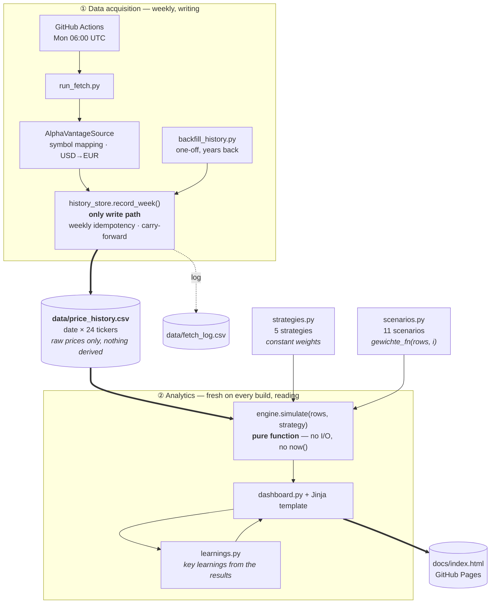

# Börsenspiel – Barbell Portfolio Dashboard

**📊 Dashboard:** [s540d.github.io/Boersenspiel](https://s540d.github.io/Boersenspiel/)

Virtual portfolio following a barbell strategy: a small, low-volatility
"safety" allocation paired with a larger, higher-conviction "growth"
allocation, instead of one broad blend. Prices are fetched weekly via GitHub
Actions, persisted as a CSV in this Git repo, and rendered as a static
dashboard on GitHub Pages.

## The portfolio

24 instruments are tracked in `instruments.py`; which of them a given
strategy actually holds, and at what weight, is decided separately in
`strategies.py`. Two buckets recur in most strategies:

- **Bucket A – Safety**: broad, low-volatility instruments — a global bond
  ETF and physical gold. Always the smaller half of the barbell (20% or 30%,
  depending on the strategy).
- **Bucket B – Growth**: broad, diversified equity exposure — a global
  equity ETF, a Nasdaq-100 ETF, a semiconductor-sector ETF, an
  emerging-markets ETF, and Bitcoin. The larger half of the barbell (80%, or
  60% in the strategy described next).

One strategy, `Barbell 20/60/20 + Single-Stock Satellite`, adds a third
bucket, **Bucket C – Single-Stock Satellite**: 10 equally-weighted individual
stocks instead of broad ETFs. "Satellite" here follows the common
core-satellite terminology from portfolio construction — a smaller,
concentrated, higher-conviction (and higher-volatility) allocation held
alongside a diversified "core", not a synonym for "additional" or "extra".
The 20 percentage points for it come out of Bucket B, so the overall risk
profile (80% risky / 20% safe) stays the same as in `Barbell 20/80` — only
the growth side becomes more concentrated. The 10 stocks deliberately mix
highly volatile growth/thematic names (Lumentum, BYD, SolarEdge, SMA Solar,
Tesla, Palantir, Strategy/formerly MicroStrategy, Rivian) with two defensive
blue chips (Coca-Cola, Roche) as a counterexample — a first pass, not an
optimized or backtested selection.

A fourth strategy, `Barbell 20/80 (diversified)`, keeps the same 20/80 risk
profile but broadens both buckets: Bucket A trades half its bond-ETF slice
for a genuine EUR money-market ETF and two bonds with a different
duration/real-rate profile, Bucket B adds a Europe ETF (to dilute the
US/tech concentration of the Nasdaq-100 and semiconductor ETFs), a real
estate ETF, and a broad commodities ETF. A fifth, `Benchmark: S&P 500 (Buy &
Hold)`, is not a barbell at all — a single, never-rebalanced position in an
S&P 500 ETF, included purely as the "just buy the index" comparison line
that was otherwise missing from the dashboard.

### Portfolio overview

All 24 tracked instruments, and which strategy actually holds each one:

| Ticker | Instrument | Held by |
|---|---|---|
| `EUNL` | MSCI World ETF (iShares Core) | Barbell 20/80, 30/70, Satellite, Diversified |
| `EUNA` | Global Aggregate Bond ETF (iShares Core) | Barbell 20/80, 30/70, Satellite, Diversified |
| `4GLD` | Xetra-Gold | Barbell 20/80, 30/70, Satellite, Diversified |
| `LYMS` | Nasdaq-100 ETF (Amundi Core) | Barbell 20/80, 30/70, Satellite, Diversified |
| `SEMI` | Global Semiconductors ETF (iShares) | Barbell 20/80, 30/70, Satellite, Diversified |
| `EIMI` | Emerging Markets IMI ETF (iShares Core) | Barbell 20/80, 30/70, Satellite, Diversified |
| `BTC-EUR` | Bitcoin | Barbell 20/80, 30/70, Satellite, Diversified |
| `LITE` | Lumentum Holdings | Barbell 20/60/20 + Single-Stock Satellite |
| `BYDDY` | BYD Company (ADR) | Barbell 20/60/20 + Single-Stock Satellite |
| `SEDG` | SolarEdge Technologies | Barbell 20/60/20 + Single-Stock Satellite |
| `S92` | SMA Solar Technology | Barbell 20/60/20 + Single-Stock Satellite |
| `TSLA` | Tesla | Barbell 20/60/20 + Single-Stock Satellite |
| `PLTR` | Palantir Technologies | Barbell 20/60/20 + Single-Stock Satellite |
| `MSTR` | Strategy Inc. (formerly MicroStrategy) | Barbell 20/60/20 + Single-Stock Satellite |
| `RIVN` | Rivian Automotive | Barbell 20/60/20 + Single-Stock Satellite |
| `KO` | Coca-Cola | Barbell 20/60/20 + Single-Stock Satellite |
| `RHHBY` | Roche Holding (ADR) | Barbell 20/60/20 + Single-Stock Satellite |
| `IUSA` | S&P 500 ETF (iShares Core) | Benchmark only |
| `XEON` | EUR money-market ETF (Xtrackers Overnight Rate) | Barbell 20/80 (diversified) |
| `EXSA` | STOXX Europe 600 ETF (iShares) | Barbell 20/80 (diversified) |
| `IBCL` | Euro government bonds 15–30y ETF (iShares) | Barbell 20/80 (diversified) |
| `IBCI` | Inflation-linked Euro government bonds ETF (iShares) | Barbell 20/80 (diversified) |
| `IQQ6` | Real estate ETF (iShares Developed Markets Property Yield) | Barbell 20/80 (diversified) |
| `EXXY` | Broad commodities ETF (iShares Diversified Commodity Swap) | Barbell 20/80 (diversified) |

`engine.simulate()` only ever reads `strategy.alle_ticker_gewichte()` — an
instrument only moves the numbers of the strategies that actually list it.
All Xetra-listed instruments above are quoted in EUR directly, so they need
no FX conversion and sidestep the currency problem described further below;
only the 10 single-stock satellite tickers (all but `S92`) trade in USD and
get converted on every fetch.

## Architecture

The project splits into two halves that only touch each other through a CSV
file: a **writing** half that fetches prices, and a **reading** half that
computes analytics from them.



### Process overview

**① Data acquisition.** Once a week, the workflow fetches a price for each of
the 24 tickers. Everything source-specific — Alpha Vantage symbols, the
USD→EUR conversion of the satellite stocks, the dedicated crypto endpoint —
stays inside `sources/`. The result is always the same: one `PriceQuote` per
ticker. Which provider delivered the price is no longer visible, or relevant,
after that point.

`history_store.record_week()` is the only way into the CSV. It keys off the
**ISO calendar week**, not the calendar date: a second run in the same week
updates the existing row instead of appending a duplicate. If a price is
missing, the last known price is carried forward (carry-forward) and noted in
`fetch_log.csv` — the row is never left with a gap. Which row a price belongs
to is decided by the **trading day** reported by the source, not the day of
the fetch: a Monday-morning run before the market opens returns Friday's
closing price from the previous week, and that belongs in Friday's week.

**Only the raw price is persisted.** No position values, no share counts, no
tax state. That is the project's central design decision: everything derived
is recomputed on every evaluation.

**② Analytics.** `engine.simulate(price_history, strategy)` receives the
complete price history and a strategy, and computes the entire portfolio
development from week one onward — initial purchase, rebalancing, fees, loss
offsetting, tax allowance, tax. No I/O, no `datetime.now()`, no state beyond
the call. Nothing is carried forward incrementally, everything is recomputed.
That is what guarantees determinism: identical price history + identical
strategy ⇒ guaranteed identical result.

Because the simulation costs nothing but compute time, `build_dashboard.py`
can run it as often as it likes — once per strategy and scenario, all against
the same price history, placing the results side by side.

**③ Key learnings.** At the very top of the dashboard sits a section that
puts the most notable findings from the comparison into words. It, too, is
**derived, not stored**: `learnings.py` only holds the *question* for each
learning, as a pure function `(views) -> Learning | None` — how wide is the
gap between the best and worst rule, where does the rule with the most trades
land in the ranking, what do fees and tax cost, how many sub-rules of a
composite strategy contribute negatively. All numbers *and* all superlatives
("biggest drag", "sole anchor") come from the current results. If the price
history changes, the statements change with it; if a question cannot be
answered from the available data (e.g. because only one strategy is
rendered), the rule returns `None` and the learning silently disappears
instead of inventing a claim.

### Strategies, scenarios, and what cuts across them

A **strategy** is a target weighting across instruments, grouped into
buckets. A **scenario** is the same data structure with an additional field
`gewichte_fn(rows, i)` — the weights are then no longer constant but
determined anew for each price row (seasonal, chart-based, momentum-driven,
…). For the engine this makes no difference: it calls the function and
rebalances toward whatever comes back. It does not know a single rule by
name.

Three properties that are easy to miss:

- **Scenarios are fully independent of one another.** Every run starts at
  week 0 with the full starting capital and only ever sees its own
  `gewichte_fn`. There is no shared state, no ordering, no interaction — the
  runs could happen in any order or in parallel.
- **Scenarios only use part of the data.** All scenarios in `scenarios.py`
  build on the buckets of `Barbell 20/80` and therefore only touch **7 of the
  24** tickers; the other 17 (the 10 satellite stocks and the 7 instruments
  from `Barbell 20/80 (diversified)`/the benchmark) only appear in specific
  strategies. The price history is deliberately broader than any single
  evaluation.
- **No lookahead.** Every `gewichte_fn` may only read `rows[:i+1]`. A rule
  deciding in week i must not know week i+1 — otherwise every result would be
  worthless.

**Cutting across all strategies and scenarios** are mechanisms that the
engine always applies identically to every run:

| Mechanism | Effect |
|---|---|
| Rebalancing | Restores target weights once the threshold is exceeded |
| Year-end tax optimization | Realizes losses or gains at the year boundary |
| Order fees | €1 per buy and sell |
| Taxation | Loss carryforward → tax-free allowance → 26.375% |

These mechanisms are currently **not toggleable**. The dashboard comparison
therefore only answers "which weighting rule performed better?", not "how
much did the tax optimization actually contribute?". A proposal to make them
individually toggleable, and thus measure their contribution as a difference,
is tracked as [#17](https://github.com/S540d/Boersenspiel/issues/17).

**Guiding principle:** Only raw data (prices) is persisted long-term. Everything derived (position values,
rebalancing, tax, tax-free allowance, loss carryforward) is recomputed
entirely from the price history on every dashboard build –
`engine.simulate()` is a pure function of (price history, strategy), with no
state of its own. Determinism follows: identical price history + identical
strategy always yields the identical result.

### Components

| File | Purpose |
|---|---|
| `src/boersenspiel/instruments.py` | The 24 instruments (7 barbell base + 10 single-stock satellite + 7 from the diversified barbell/benchmark; ticker, ISIN) – source-independent |
| `src/boersenspiel/strategies.py` | Interchangeable strategy definitions (weights, buckets, rebalancing threshold) + cross-strategy tax/fee constants |
| `src/boersenspiel/history_store.py` | Only write path to `data/price_history.csv` / `data/fetch_log.csv` |
| `src/boersenspiel/sources/` | Interchangeable price sources (default: `alphavantage.py`) |
| `src/boersenspiel/engine.py` | Pure simulation function: (price history, strategy) → portfolio/tax state |
| `src/boersenspiel/dashboard.py` | Renders simulation results as `docs/index.html`, one `docs/<slug>.html` detail page per strategy, and `docs/praemissen.html` (premises and assumptions). Every value-history chart on the start and detail pages also gets a client-side observation-period switcher (1/3/5 years back or full history), backed by four fully re-simulated presets per strategy computed at build time ([#54](https://github.com/S540d/Boersenspiel/issues/54)) |
| `src/boersenspiel/templates/` | Jinja templates: `base.html.j2` (shared shell incl. the three-dot menu), `dashboard.html.j2`, `strategy_detail.html.j2`, `praemissen.html.j2` |
| `src/boersenspiel/learnings.py` | Re-derives the key-learnings text on every build from the simulation results (no stored insights) |
| `scripts/run_fetch.py` | Automated weekly price fetch (GitHub Actions) |
| `scripts/backfill_history.py` | One-off historical backfill of `price_history.csv` (real weekly prices instead of only live-collected weeks, see below) |
| `scripts/build_dashboard.py` | Rebuilds `docs/index.html` from the current price history |

## Switching the price source

Price fetching is deliberately abstracted behind a narrow interface
(`PriceSource`) and runs through `history_store.record_week()` – no matter
where the prices come from, they end up in the same CSV format with the same
weekly idempotency and the same carry-forward note for missing prices.

Price fetching runs exclusively through GitHub Actions:
`scripts/run_fetch.py` uses `AlphaVantageSource` – the official, API-key-based
Alpha Vantage REST API (`src/boersenspiel/sources/alphavantage.py`). Requires
the `ALPHAVANTAGE_API_KEY` environment variable (see below). Ticker symbol
mapping lives exclusively in this file. A manual, non-Actions entry point
(via Cowork/web search) existed earlier but was removed
([#51](https://github.com/S540d/Boersenspiel/issues/51)) in favor of a single,
consistent GitHub Actions path.

### Setting up Alpha Vantage

Get a free API key from
[alphavantage.co](https://www.alphavantage.co/support/#api-key) (25
requests/day, max. 1 request/second) and store it as a GitHub Actions
secret: Settings → Secrets and variables → Actions → New repository secret →
name `ALPHAVANTAGE_API_KEY`. That's the whole setup.

The one non-obvious part is the ticker symbol mapping, verified via
`SYMBOL_SEARCH`: the Xetra suffix is `.DEX` (not `.DE`); EIMI trades on
Xetra under the local code `IBC3.DEX`; SEMI (iShares Global Semiconductors)
is not listed on Xetra, only via the Amsterdam listing `SEMI.AMS` (also in
EUR); BTC-EUR goes through the separate `DIGITAL_CURRENCY_DAILY` endpoint.
The 10 single stocks of the satellite bucket run directly on their US ticker
in USD except for SMA Solar (`S92.DEX`, Xetra), including the two ADRs
BYDDY (BYD) and RHHBY (Roche) - a continuous EUR listing on the Frankfurt
Stock Exchange/Xetra doesn't exist for every stock (e.g. not for Coca-Cola).
`AlphaVantageSource` therefore converts these `USD_TICKERS` on every fetch
using the current `CURRENCY_EXCHANGE_RATE` (USD→EUR); if that conversion
fails, the affected tickers are marked `missing` for the week
(carry-forward applies) instead of storing a wrongly converted price.

## Historical backfill

`data/price_history.csv` normally only grows week by week since project
start (`GLOBAL_QUOTE` only returns the current price). For meaningful
simulations across multiple market cycles (e.g. so that seasonal scenarios
like "Sell in May" or the 40-week SMA crossover have enough history to work
with in the first place), there is `scripts/backfill_history.py`: it uses
`TIME_SERIES_WEEKLY` / `DIGITAL_CURRENCY_WEEKLY` (return the complete
available history in **one** request per ticker, unlike `GLOBAL_QUOTE`) and
writes the result through `history_store.record_week()` (the same path as
the live fetch, including weekly idempotency and carry-forward), rewriting
`price_history.csv` completely. USD-denominated tickers are converted using
the historical `FX_WEEKLY` rate for the same week (forward-fill if no FX
rate is available for a given week).

```bash
python scripts/backfill_history.py --years 20  # default: 20 years back (lower bound only)
```

Uses exactly 25 requests (23 non-crypto tickers + 1× `FX_WEEKLY` + 1× crypto)
— the full daily free-tier limit, with no headroom left since the seven
additional instruments were added. A re-run after a network error, a debug
call, or the weekly fetch on the same day will all breach it. An unresolvable
ticker symbol aborts the run without returning the requests already spent, so
verify symbols (`SYMBOL_SEARCH`) before adding an instrument;
`tests/test_backfill_history.py` guards the budget itself. **Replaces** `price_history.csv` completely -
no merging with previously live-collected weeks is needed, since the backfill
already covers those (and older) weeks anyway.

### Hand-maintained additions

Because the backfill rewrites `price_history.csv` from scratch, anything
researched by hand would be lost on the next run. Two files are therefore
**only ever read, never written by any script**, and are merged back in on
every run:

| File | Columns | Merged |
|---|---|---|
| `data/manual_fx_usd_eur.csv` | `Date,EUR_pro_USD` | **before** the currency conversion |
| `data/manual_prices.csv` | `Date,Ticker,Preis_EUR` | **last**, so values are already in EUR |

The FX file is the higher-leverage one: Alpha Vantage's `FX_WEEKLY` only
goes back to 21 November 2014, and the backfill deliberately refuses to
convert earlier weeks with a later rate. A single rate makes that week
convertible for all nine USD tickers *and* BTC-EUR at once. It already ships
filled: 2,272 **daily** ECB euro foreign exchange reference rates covering
2006-01-02 to 2014-11-14, so every weekly close is converted at its own
trading day's rate rather than a neighbouring week's. Coverage deliberately
stops at ISO week 46/2014 so `FX_WEEKLY` data stays untouched from week 47
onwards.

Use `manual_prices.csv` only for prices the API doesn't have at all (e.g. the
earliest BTC history) — and make sure they are split-adjusted.

`_fx_luecken()` reports any period without FX coverage, checking not just the
start of the series but gaps *inside* it — once the manual file covers the
early years the series starts in 2006, and a start-only check would no longer
notice a hole opening up if Alpha Vantage's window drifts forward over time.

Hand-maintained values win over the API, compared at **ISO week** level, so
a manual Friday entry replaces an API Thursday value from the same week
rather than sitting next to it. Both files accept `#` comment lines and
carry their own documentation; an unknown ticker aborts the run instead of
being silently ignored. Each run prints how many weeks were added and how
many replaced — remove entries once the API covers them itself.

Because the API key lives as a repo secret (and not on every developer
machine), there is also a manually triggered workflow **"Historical Backfill
(manual)"** (`.github/workflows/backfill.yml`): Actions → select workflow →
*Run workflow* → set `years` and type `REPLACE` to confirm (the run aborts
otherwise, since it completely replaces the price history). The workflow
runs tests, the backfill, a plausibility check (row count, date range,
tickers with price gaps land in the job summary), the dashboard build, the
commit of the data files, and the Pages deploy. **Don't start it on the same
day as the weekly price fetch** - 18 + 18 requests exceed the daily limit of
25.

## Adding a strategy

New strategies are added as another `Strategy` entry in
`src/boersenspiel/strategies.py` (starting capital, buckets with sub-weights,
target bucket, target weight, rebalancing threshold in percentage points) and
added to the `STRATEGIES` list – the engine contains no barbell-specific
assumptions, `dashboard.py` automatically renders all strategies listed in
`STRATEGIES` side by side. Currently defined: `Barbell 20/80`, `Barbell
30/70` (example of an alternative weighting), `Barbell 20/60/20 +
Single-Stock Satellite` (extends Barbell 20/80 with a third bucket of 10
equally-weighted single stocks instead of broad ETFs – overall risk profile
of 80% risky / 20% safe is preserved), `Barbell 20/80 (diversified)`
(broadens both buckets with a genuine cash instrument, additional bond
profiles, Europe, real estate, and commodities), and `Benchmark: S&P 500
(Buy & Hold)` (single-instrument reference line) – see `strategies.py` for
details and the rationale behind each.

### Scenarios

In addition to the strategies, `scenarios.py` contains time-dependent
evaluation scenarios: the same Barbell-20/80 structure (bucket A "Safety",
bucket B "Growth", 7 instruments), but with a rule that redetermines the
target weights for each price row instead of keeping them constant. First
pass – parameters are not optimized or backtested. Starting capital is
€10,000 in each case, all runs independent of one another (see
[Architecture](#architecture) above).

**Market wisdoms**

| Scenario | Rule |
|---|---|
| Sell in May | Defensive (100% safety) May–September, normal 20/80 split October–April |
| Buy & Hold | Starting allocation is never actively rebalanced (rebalancing threshold effectively unreachable); December tax optimization stays active as for all strategies. In the combined "Market Wisdoms" scenario below it acts differently: it always votes for the normal 80% share as a dampening anchor, since "don't rebalance at all" can't itself be expressed as a share vote (clarified in [#27](https://github.com/S540d/Boersenspiel/issues/27)) |
| Santa Claus Rally | Growth share set to 95% in December/January, normal split otherwise |
| Buy the Dip | Growth share set to 95% as soon as the MSCI World ETF (EUNL) trades more than 10% below its 20-week high |
| Cut Your Losses | Trailing stop per growth instrument: if one falls more than 15% below its own 20-week high, only that instrument is set to 0% (rest of the portfolio unchanged) |
| Market Wisdoms (all five combined) | Combines the five wisdoms above into **one** strategy (see below) and reports each saying's individual effect via leave-one-out |

The five solo scenarios above are sub-scenarios of "Market Wisdoms (all five
combined)" (`Strategy.teil_von`, [#30](https://github.com/S540d/Boersenspiel/issues/30)) —
the dashboard home page shows them together with the combined strategy in a
dedicated comparison chart, in addition to appearing individually among all
other strategies/scenarios.

**How the five wisdoms are combined.** The rules partly contradict each other
— in May "Sell in May" wants out, while a simultaneous price drop makes "Buy
the Dip" want in. Instead of applying them hard, one after another, they
therefore run in two phases:

1. **Share vote.** Each wisdom proposes a growth share, or *abstains* if its
   condition doesn't apply this week. The target is the **arithmetic mean of
   the votes cast** — contradictory signals partly cancel out instead of one
   rule overriding the others. "Buy & Hold" (= "don't rebalance anything")
   is the only one that always votes for the normal 80% share, acting as a
   dampening anchor; that guarantees at least one vote at all times.
2. **Instrument overlay.** "Cut Your Losses" doesn't act on the overall
   share, but per instrument, and is therefore applied afterward to the
   result of phase 1.

**Effect per saying.** The strategy's detail section shows a bar chart
"Effect of the individual market wisdoms": for each saying, the
**leave-one-out** difference in percentage points, i.e. the return of the
full strategy minus the return of the same strategy *without* exactly that
saying. Positive means: the saying added return. Because the rules affect
each other, the individual contributions don't sum up exactly to the total
return — it's a marginal, not an additive decomposition.

**Chart patterns**

| Scenario | Rule |
|---|---|
| SMA Crossover (10/40 weeks) | Golden Cross/Death Cross on the MSCI World ETF: 10-week SMA below 40-week SMA → defensive (100% safety), normal split otherwise |
| SMA Crossover (4/20 weeks) | Same Golden Cross/Death Cross rule with a shorter window (4/20 weeks ≈ 21/100 trading days instead of 50/200) for a more responsive signal ([#28](https://github.com/S540d/Boersenspiel/issues/28)) |

**Other approaches**

| Scenario | Rule |
|---|---|
| Momentum: relative strength rotation | Within the growth bucket (total weight stays 80%), only the 2 instruments with the highest 12-week trailing return are held, equally weighted; the rest are set to 0% |
| Volatility-based equity share | Growth share scales linearly between 50% (high) and 90% (low realized 12-week volatility of the MSCI World ETF) – risk-parity/vol-targeting principle |
| Cost-average entry (10 weeks) | Growth share ramps linearly from 0% to the normal 80% split over the first 10 weeks, instead of investing the starting capital all at once |

Details, parameters, and derivations are documented as comments directly at
the respective `gewichte_fn` implementations in `scenarios.py`.

## Running locally

```bash
pip install -r requirements.txt

# Fetch prices via Alpha Vantage (ALPHAVANTAGE_API_KEY must be set)
python scripts/run_fetch.py

# Build the dashboard
python scripts/build_dashboard.py
# -> open docs/index.html in a browser

# Tests
pytest -q
```

## Engine modeling decisions

- **No separate cash position:** When a scenario switches to "defensive"
  (e.g. "Sell in May", the SMA death cross, or the "limit losses" trailing
  stop), the capital moves entirely into bucket A (safety: EUNL/EUNA/4GLD —
  broad bond and gold ETFs), **not** into an unremunerated or fixed-interest
  cash holding. In this model, bucket A **is** the cash role: liquid, broadly
  diversified, and markedly less volatile than bucket B, but not guaranteed
  to hold its value. A separate, genuine cash position would have two
  drawbacks: (1) it would need a made-up interest rate (see
  [#35](https://github.com/S540d/Boersenspiel/issues/35)) instead of a value
  derivable from the price history, breaking the principle that everything
  derived comes exclusively from real market data; (2) it would implicitly
  duplicate bucket A without serving any other purpose. Discussed and
  decided in [#35](https://github.com/S540d/Boersenspiel/issues/35).
  A different, purely technical kind of "cash" still exists internally:
  `pending_cash` in `engine.py` temporarily parks the target share of an
  instrument that has no price *at all yet* for the current row (not yet
  listed, or — before [#55](https://github.com/S540d/Boersenspiel/issues/55) —
  no tradeable bucket-A target). It is not a strategic allocation, only a
  bookkeeping placeholder invested as soon as a target exists (see
  `handelbare_gewichte()` below). Checked against the real 20-year history
  after #55: every strategy and scenario holds 0% cash at every point in
  time, with a single exception — "Sell in May" holds 100% cash for 27
  weeks (September 2006 and May–September 2007), because 4GLD, the only
  bucket-A instrument available that early, has no price before
  2008-01-11 and the defensive season therefore had no target at all. The
  case never recurs after 2008.
- **Initial purchase:** Order fees (€1/trade) are deducted **from the
  starting capital before the split** across buckets.
- **Later trades** (rebalancing, December harvest): fees reduce the realized
  gain on sale and are added to the cost basis on purchase (standard
  transaction cost treatment).
- **Cost basis** is tracked per instrument using the average-cost method (no
  FIFO/LIFO with individual lots).
- **Rebalancing**, once triggered (deviation from the target bucket weight
  exceeds the threshold), brings **all** instruments back to their target
  weight, not just the triggering bucket.
- **Rebalancing conserves portfolio value by construction.**
  `rebalance_to_targets()` keeps no cash account: sale proceeds are never
  credited anywhere, purchase amounts never withdrawn. The reshuffle is
  value-neutral *only* because the `diffs` across **all** instruments add up
  to exactly the available `pending_cash`. Silently skipping an instrument
  breaks that invariant and makes money disappear — the sales still run
  while the matching purchase is dropped.
- **Instruments that did not exist yet** (`handelbare_gewichte()`): over a
  20-year history a large share of the instruments has no price at the start
  (Bitcoin before 2009, Rivian before its 2021 IPO, most of the ETFs early
  on). Their target share is **redistributed proportionally across the
  instruments that are actually tradeable**, rather than parked
  uninvested — otherwise more than 60% of the portfolio would sit idle at
  the start of the history and the returns of the early years would be
  largely meaningless (measured: €89,408 final value when parking vs.
  €125,893 when redistributing). Relative proportions *within* the available
  instruments are preserved. Two events put capital to work, **both
  deliberately independent of `opt.rebalancing`** (they are initial
  purchases, not drift correction — otherwise `BUY_AND_HOLD` would never
  hold an instrument that didn't exist when the simulation started):
  `neues_instrument` once a ticker first has a price, and `kapitaleinsatz`
  once parked cash has a tradeable target again. The latter is needed
  because the rebalancing trigger only checks bucket A: if *no* target
  instrument was tradeable for a while (e.g. "Sell in May" starts defensively
  in September 2006, but bucket A only exists from 2008), bucket A's actual
  and target weights are both 0 and the parked capital would never be
  deployed. If no target instrument is tradeable at all, everything stays
  parked — deliberately: "out of the market" with no defensive instrument
  available *is* cash.
- **Company-specific dividend amounts are not modeled.** The 10 single-stock
  satellite instruments (`Instrument.ausschuettend`) use a flat placeholder
  dividend yield (`DIVIDENDENRENDITE_PLATZHALTER`, 2.5% p.a.) instead of
  their real historical dividend history – some of the 10 don't actually pay
  a dividend, others pay more or less than the placeholder
  ([#57](https://github.com/S540d/Boersenspiel/issues/57)). The dividend is
  booked as real cash once a year, reinvested via the existing cash-parking
  mechanism, and taxed like a real capital gain. The ETFs, the bond fund,
  physical gold, and BTC-EUR still pay no dividend at all in the simulation.
- **December harvest:** On the last price row of a completed calendar year,
  exactly one of two mutually exclusive measures applies, depending on how
  the tax year has gone so far (see
  [#13](https://github.com/S540d/Boersenspiel/issues/13)/[#16](https://github.com/S540d/Boersenspiel/issues/16)):
  (A) **Tax-free-allowance profit taking**, as long as the year's tax-free
  allowance hasn't been used up yet: profit positions (largest unrealized
  gain first) are sold **partially** and immediately repurchased at the same
  price, until the realized gain exactly exhausts (not exceeds) the
  remaining allowance — the gain stays tax-free, the cost basis is raised
  tax-free. (B) **True tax-loss harvesting**, as soon as a taxable gain has
  already been realized during the year (i.e. the allowance is already at
  0): loss positions (largest unrealized loss first) are sold partially and
  immediately repurchased, until the realized losses cover the taxable
  portion of the year's gains — this doesn't retroactively shift the
  already-taxed gain total, but builds up a loss carryforward that reduces
  future gains.
- **Tax logic:** loss
  offsetting before the tax-free allowance before tax (26.375%), tax-free
  allowance of €1,000/year resetting at the calendar year boundary, one
  shared loss/allowance pool for capital-gains-taxed instruments. Three
  corrections on top of the original spec (#37/#38/#39, tracked in #46):
  - **Partial tax exemption (Teilfreistellung, #38):** realized gains and
    losses on equity-fund ETFs (>51% equity allocation — EUNL, LYMS, SEMI,
    EIMI) are reduced by the statutory 30% (§ 20 InvStG) before entering the
    loss/allowance pool. Bond ETFs (EUNA), physical gold (4GLD), individual
    stocks, and BTC-EUR (no fund privilege) get no exemption.
  - **Advance lump-sum tax (Vorabpauschale, #39):** for instruments flagged
    accumulating (thesaurierend), a simplified annual Vorabpauschale is
    applied at each completed year's harvest date — capped at that year's
    actual value increase — consuming part of that year's allowance before
    the December harvest decision runs, and raising the position's cost
    basis by the full (pre-exemption) amount. **Documented simplification:**
    the base interest rate (Basiszins) is a constant placeholder
    (`VORABPAUSCHALE_BASISZINS_PLATZHALTER` in `strategies.py`) rather than
    the real, annually published BMF rate, and the timing (year-end instead
    of the first business day of the following year) is approximated —
    real historical Basiszins values are still needed to replace the
    placeholder.
  - **Crypto speculation period (Spekulationsfrist, #37):** BTC-EUR gains are
    excluded from the capital-gains loss/allowance pool entirely. Instead, a
    simplified average-purchase-date holding period (analogous to the
    average-cost method already used for cost basis) decides per sale: held
    over 365 days → completely tax-free (§ 23 EStG); held 365 days or less →
    taxed via a separate, all-or-nothing €1,000/year exemption threshold
    (Freigrenze, not an allowance — crossing it makes the *entire* year's
    gain taxable, not just the excess), using the flat capital-gains rate as
    a documented simplification for the actual personal income tax rate.
    BTC-EUR is therefore also excluded from the December harvest measures,
    which only ever optimize the capital-gains pool.

## Known limitations

- **Hindsight bias in instrument selection:** the instruments allocated to a
  strategy or scenario were picked when their price history was already
  known. A backtested return therefore does not answer "what would I have
  earned?", only "how would these rules have played out on these,
  retrospectively chosen, instruments?". This applies less to `IUSA`
  (the S&P 500 benchmark, `Benchmark: S&P 500 (Buy & Hold)`) — as a
  standard broad-market index it wasn't picked for its own return, only as
  the neutral "just buy the index" comparison line. The
  scenario rules themselves are a first pass, neither optimized nor
  backtested, and everything rests on a single historical price series — no
  Monte Carlo, no confidence intervals. Differences of a few percentage
  points between two strategies are not meaningful. The dashboard's
  **Premises page** (`docs/praemissen.html`, reachable from the three-dot
  menu on every page) spells this out for readers.
- **Placeholder constants:** `VORABPAUSCHALE_BASISZINS_PLATZHALTER` (2.0%)
  is not a real annual BMF base rate, and `_RISIKOFREIER_ZINS_PLATZHALTER`
  (0%) used by the Sharpe/Sortino ratios is not a real reference rate. Taxes
  use the flat withholding rate rather than a personal income tax rate, and
  the simulated portfolio value itself is never reduced by tax — the tax
  figures are tracking only.
- **`BTC-EUR` history is far shorter than requested:** the 20-year backfill
  yields only ~50 weeks (from 2025-09-14), so Bitcoin is first bought near
  its high rather than across the full period — see
  [#56](https://github.com/S540d/Boersenspiel/issues/56).
- **Alpha Vantage free-tier limit:** 25 requests/day, max. 1 request/second.
  Still unproblematic for the current 24 tickers fetched once a week, but
  barely any headroom for additional manual fetches on the same day;
  `AlphaVantageSource` sleeps between requests. If a price still fails (e.g.
  due to rate limiting or an empty response), the last known price is
  carried forward and noted in `fetch_log.csv` (a row is never left with a
  gap).
- **BTC-EUR/Xetra time offset:** A Monday-morning run returns the previous
  week's Friday close for the Xetra ETFs, but for BTC-EUR (24/7 market) a
  slightly more recent, time-shifted price – the "weekly" row therefore
  mixes prices from a window of up to about 2–3 days. Which week the row is
  assigned to is instead decided by the *most common* reported trading day
  (i.e. the shared exchange trading day, not the deviating BTC day) – see
  `history_store.row_date_from_quotes()`.
- **One-time manual repo settings** (not settable via workflow YAML):
  Settings → Actions → General → Workflow permissions → "Read and write
  permissions"; Settings → Pages → Source → "GitHub Actions".
- `data/price_history.csv` deliberately starts empty (header only) – the
  first real row is created by the first workflow run (possibly triggered
  manually via `workflow_dispatch`), not by manual seeding.
