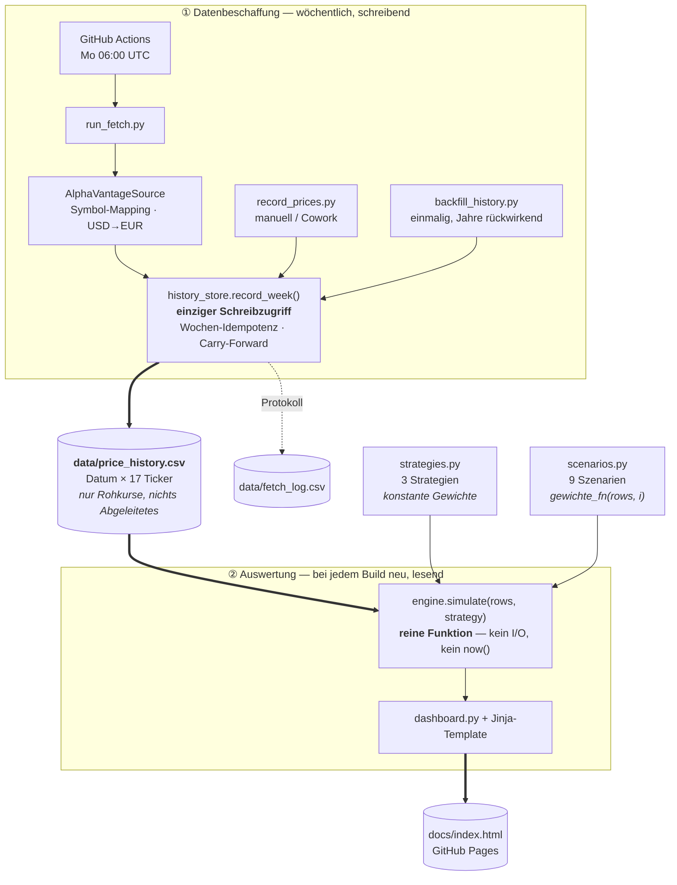

# Börsenspiel – Barbell-Portfolio-Dashboard

**📊 Dashboard:** [s540d.github.io/Boersenspiel](https://s540d.github.io/Boersenspiel/)

Virtuelles Portfolio nach Barbell-Strategie, auf Basis des Pflichtenhefts
`Pflichtenheft_PortfolioProjekt_v2.md`. Technisch wurde bewusst abweichend
umgesetzt (siehe [Abweichungen](#abweichungen-vom-pflichtenheft) unten):
Kursabruf wöchentlich statt täglich, Persistenz als CSV im Git-Repo statt
Google Sheet, Ausgabe als statisches Dashboard auf GitHub Pages.

## Architektur

Das Projekt zerfällt in zwei Hälften, die sich ausschließlich über eine CSV-Datei
berühren: eine **schreibende** Hälfte, die Kurse beschafft, und eine **lesende**
Hälfte, die daraus Auswertungen rechnet.



### Prozess im Überblick

**① Datenbeschaffung.** Einmal pro Woche holt der Workflow für jeden der 17 Ticker
einen Kurs. Alles, was quellenspezifisch ist — Alpha-Vantage-Symbole, die
USD→EUR-Umrechnung der Satelliten-Aktien, der eigene Krypto-Endpunkt — bleibt in
`sources/`. Am Ende steht immer dasselbe: ein `PriceQuote` je Ticker. Wer die
Kurse geliefert hat, ist ab da nicht mehr erkennbar und auch nicht mehr relevant.

`history_store.record_week()` ist der einzige Weg in die CSV. Es schlüsselt über
die **ISO-Kalenderwoche**, nicht über das Kalenderdatum: ein zweiter Lauf in
derselben Woche aktualisiert die bestehende Zeile, statt eine Dublette anzuhängen.
Fehlt ein Kurs, wird der letzte bekannte übernommen (Carry-Forward) und in
`fetch_log.csv` vermerkt — die Zeile bleibt lückenlos. Eingeordnet wird die Zeile
über den **Handelstag**, den die Quelle meldet, nicht über den Tag des Abrufs:
ein Montagslauf vor Börsenbeginn liefert den Freitagsschluss der Vorwoche, und der
gehört in die Freitags-Woche.

**Gespeichert wird ausschließlich der Rohkurs.** Keine Positionswerte, keine
Stückzahlen, kein Steuerstand. Das ist die zentrale Entscheidung des Projekts:
alles Abgeleitete entsteht bei jeder Auswertung neu.

**② Auswertung.** `engine.simulate(price_history, strategy)` bekommt die komplette
Kurshistorie und eine Strategie und rechnet die gesamte Depotentwicklung von der
ersten Woche an durch — Initialkauf, Rebalancing, Gebühren, Verlustverrechnung,
Freibetrag, Steuer. Kein I/O, kein `datetime.now()`, kein Zustand über den Aufruf
hinaus. Nichts wird fortgeschrieben, alles wird neu gerechnet. Daraus folgt der
Determinismus: gleiche Kurshistorie + gleiche Strategie ⇒ garantiert gleiches
Ergebnis.

Weil die Simulation nichts kostet außer Rechenzeit, kann `build_dashboard.py`
sie beliebig oft laufen lassen — einmal pro Strategie und Szenario, alle gegen
dieselbe Kurshistorie, und stellt die Ergebnisse nebeneinander.

### Strategien, Szenarien und was quer dazu liegt

Eine **Strategie** ist eine Ziel-Gewichtung über Instrumente, gruppiert in Töpfe.
Ein **Szenario** ist dieselbe Datenstruktur mit einem zusätzlichen Feld
`gewichte_fn(rows, i)` — die Gewichte sind dann nicht mehr konstant, sondern
werden je Kurszeile neu bestimmt (saisonal, charttechnisch, nach Momentum …).
Für die Engine ist das kein Unterschied: sie ruft die Funktion auf und
rebalanciert auf das, was zurückkommt. Sie kennt keine einzige Regel namentlich.

Drei Eigenschaften, die dabei leicht übersehen werden:

- **Szenarien sind vollständig unabhängig voneinander.** Jeder Lauf startet bei
  Woche 0 mit dem vollen Startkapital und sieht nur seine eigene `gewichte_fn`.
  Es gibt keinen gemeinsamen Zustand, keine Reihenfolge, keine Wechselwirkung —
  die Läufe könnten in beliebiger Ordnung oder parallel stattfinden.
- **Szenarien nutzen nur einen Teil der Daten.** Alle Szenarien in `scenarios.py`
  bauen auf den Töpfen von `Barbell 20/80` auf und rühren damit nur **7 der 17**
  Ticker an; die 10 Satelliten-Aktien kommen ausschließlich in
  `Barbell 20/60/20 + Einzelaktien-Satellit` vor. Die Kurshistorie ist bewusst
  breiter als jede einzelne Auswertung.
- **Kein Lookahead.** Jede `gewichte_fn` darf ausschließlich `rows[:i+1]` lesen.
  Eine Regel, die in Woche i entscheidet, darf Woche i+1 nicht kennen — sonst
  wäre jedes Ergebnis wertlos.

**Quer zu allen Strategien und Szenarien** liegen Mechanismen, die die Engine
immer und für jeden Lauf identisch anwendet:

| Mechanismus | Wirkung |
|---|---|
| Rebalancing | Rückführung auf die Zielgewichte bei Überschreiten der Schwelle |
| Steueroptimierung am Jahresende | Realisierung von Verlusten bzw. Gewinnen zur Jahresgrenze |
| Ordergebühren | 1 € je Kauf und Verkauf |
| Besteuerung | Verlustvortrag → Freibetrag → 26,375 % |

Diese Mechanismen sind heute **nicht abschaltbar**. Der Dashboard-Vergleich
beantwortet damit nur die Frage „welche Gewichtungsregel war besser?", nicht die
Frage „wie viel hat eigentlich die Steueroptimierung beigetragen?". Ein Vorschlag,
sie einzeln zuschaltbar zu machen und damit ihren Beitrag als Differenz messbar zu
machen, liegt als [#17](https://github.com/S540d/Boersenspiel/issues/17) vor.

> **Hinweis zum Stand:** An zwei Stellen weicht das tatsächliche Verhalten von der
> hier beschriebenen Absicht ab — die Jahresend-Steueroptimierung feuert auch im
> laufenden, unvollständigen Jahr ([#9](https://github.com/S540d/Boersenspiel/issues/9)),
> und ihre Auslösebedingung ist steuerlich nicht sinnvoll gewählt
> ([#13](https://github.com/S540d/Boersenspiel/issues/13),
> [#16](https://github.com/S540d/Boersenspiel/issues/16)). Instrumente ohne Kurs in
> der ersten Zeile verlieren zudem still ihren Kapitalanteil
> ([#10](https://github.com/S540d/Boersenspiel/issues/10)).

**Leitprinzip (aus dem Pflichtenheft übernommen):** Nur Rohdaten (Kurse)
werden dauerhaft gespeichert. Alles Abgeleitete (Positionswerte,
Rebalancing, Steuer, Freibetrag, Verlustvortrag) wird bei jeder
Dashboard-Erzeugung komplett neu aus der Kurshistorie berechnet –
`engine.simulate()` ist eine reine Funktion aus (Kurshistorie, Strategie),
ohne eigenen Zustand. Determinismus ist damit garantiert: identische
Kurshistorie + identische Strategie ergeben immer dasselbe Ergebnis.

### Komponenten

| Datei | Zweck |
|---|---|
| `src/boersenspiel/instruments.py` | Die 17 Instrumente (7 Barbell-Basisinstrumente + 10 Einzelaktien-Satellit; Ticker, ISIN) – quellenunabhängig |
| `src/boersenspiel/strategies.py` | Austauschbare Strategie-Definitionen (Gewichte, Töpfe, Rebalancing-Schwelle) + Steuer-/Gebührkonstanten |
| `src/boersenspiel/history_store.py` | Einziger Schreibzugriff auf `data/price_history.csv` / `data/fetch_log.csv` |
| `src/boersenspiel/sources/` | Austauschbare Kursquellen (Standard: `alphavantage.py`) |
| `src/boersenspiel/engine.py` | Reine Simulationsfunktion: (Kurshistorie, Strategie) → Portfolio-/Steuerzustand |
| `src/boersenspiel/dashboard.py` | Rendert Simulationsergebnisse als `docs/index.html` |
| `scripts/run_fetch.py` | Automatisierter wöchentlicher Kursabruf (GitHub Actions) |
| `scripts/record_prices.py` | Manueller Andockpunkt für Kurse aus anderer Quelle (z. B. Cowork/Websuche) |
| `scripts/backfill_history.py` | Einmaliger historischer Backfill von `price_history.csv` (echte Wochenkurse statt nur live gesammelter Wochen, siehe unten) |
| `scripts/build_dashboard.py` | Baut `docs/index.html` neu aus der aktuellen Kurshistorie |

## Kursquelle wechseln

Der Kursabruf ist bewusst hinter einer schmalen Schnittstelle
(`PriceSource`) abstrahiert und läuft über `history_store.record_week()` –
egal woher die Kurse kommen, landen sie im selben CSV-Format mit derselben
Wochen-Idempotenz und demselben Carry-Forward-Vermerk bei fehlenden Kursen.

- **Standard (GitHub Actions):** `scripts/run_fetch.py` nutzt
  `AlphaVantageSource` – die offizielle, API-Key-basierte Alpha-Vantage-
  REST-API (`src/boersenspiel/sources/alphavantage.py`). Benötigt die
  Umgebungsvariable `ALPHAVANTAGE_API_KEY` (siehe unten). Ticker-Symbol-
  Mapping liegt ausschließlich in dieser Datei.
- **Zuvor genutzt, weiterhin im Repo vorhanden:** `YfinanceStooqSource`
  (`src/boersenspiel/sources/yfinance_stooq.py`, yfinance primär, Stooq-CSV
  als Fallback) – wurde als Standardquelle abgelöst, da yfinance
  wiederholt an Yahoos Crumb/Cookie-Authentifizierung scheiterte (leere
  Antworten für alle Ticker, siehe Bekannte Einschränkungen unten). Bleibt
  als Beispiel für eine austauschbare Quelle im Repo, wird aber von
  `run_fetch.py` nicht mehr aufgerufen.
- **Alternative (Cowork/Websuche):** Um weder ein API-Key-Limit noch
  Ticker-Symbol-Mappings pflegen zu müssen, kann der Kursabruf stattdessen
  manuell/über einen Cowork-Scheduled-Task laufen, der die Kurse per
  Websuche ermittelt und direkt an
  `scripts/record_prices.py --date ... --prices '{"EUNL": ..., ...}'`
  übergibt. Dazu einfach den `run_fetch.py`-Schritt (oder den ganzen Cron)
  im Workflow deaktivieren. Engine, Dashboard und Tests bleiben davon
  unberührt.

Die Entscheidung zwischen den Wegen kann jederzeit und situativ getroffen
werden, ohne Code umzubauen.

### Alpha Vantage einrichten

1. API-Key auf [alphavantage.co](https://www.alphavantage.co/support/#api-key)
   holen (kostenloser Plan: 25 Requests/Tag, max. 1 Request/Sekunde – bei
   aktuell 17 Tickern einmal wöchentlich noch ausreichend, aber ohne viel
   Spielraum für zusätzliche manuelle Abrufe am selben Tag).
2. Als GitHub-Actions-Secret hinterlegen: Settings → Secrets and variables
   → Actions → New repository secret → Name `ALPHAVANTAGE_API_KEY`.
3. Ticker-Symbole wurden per `SYMBOL_SEARCH` verifiziert und weichen teils
   vom naheliegenden Muster ab: Xetra-Suffix ist `.DEX` (nicht `.DE`); EIMI
   läuft auf Xetra unter dem lokalen Kürzel `IBC3.DEX`; SEMI (iShares
   Global Semiconductors) ist auf Xetra nicht gelistet, nur über die
   Amsterdam-Notierung `SEMI.AMS` (ebenfalls in EUR) verfügbar. BTC-EUR
   läuft über den separaten `DIGITAL_CURRENCY_DAILY`-Endpunkt. Die 10
   Einzelaktien des Satelliten-Topfs laufen bis auf SMA Solar (`S92.DEX`,
   Xetra) direkt über ihren US-Ticker in USD, inkl. der beiden ADRs BYDDY
   (BYD) und RHHBY (Roche) - eine durchgängige EUR-Notierung an der
   Frankfurter Börse/Xetra existiert nicht für jeden Wert (z. B. nicht für
   Coca-Cola). Deshalb rechnet `AlphaVantageSource` diese `USD_TICKERS` bei
   jedem Abruf per aktuellem `CURRENCY_EXCHANGE_RATE` (USD→EUR) um - sonst
   würde die (währungsblinde) Engine USD-Beträge fälschlich als EUR
   behandeln. Schlägt der EUR/USD-Abruf fehl, werden die betroffenen Ticker
   für diese Woche als `missing` markiert (Carry-Forward greift), statt
   einen falsch umgerechneten Kurs zu speichern.

## Historischer Backfill

`data/price_history.csv` wächst im Normalbetrieb nur Woche für Woche seit
Projektstart (`GLOBAL_QUOTE` liefert nur den aktuellen Kurs). Für
aussagekräftige Simulationen über mehrere Marktzyklen (z. B. damit
saisonale Szenarien wie "Sell in May" oder der 40-Wochen-SMA-Crossover
überhaupt genug Historie zum Greifen haben) gibt es
`scripts/backfill_history.py`: nutzt `TIME_SERIES_WEEKLY` /
`DIGITAL_CURRENCY_WEEKLY` (liefern die komplette verfügbare Historie in
**einem** Request pro Ticker, anders als `GLOBAL_QUOTE`) und schreibt das
Ergebnis über `history_store.record_week()` (denselben Pfad wie der
Live-Abruf, inkl. Wochen-Idempotenz und Carry-Forward) komplett neu in
`price_history.csv`. USD-notierte Ticker werden dabei mit dem historischen
`FX_WEEKLY`-Kurs der jeweils selben Woche umgerechnet (Forward-Fill, falls
für eine Woche kein FX-Kurs vorliegt).

```bash
python scripts/backfill_history.py --years 5   # Default: 5 Jahre zurück
```

Verbraucht einmalig ca. 18 Requests (16 nicht-Krypto-Ticker + 1× `FX_WEEKLY`
+ 1× Krypto) - passt ins tägliche Free-Tier-Limit von 25, sollte aber nicht
mehrfach am selben Tag laufen. **Ersetzt** `price_history.csv` komplett -
kein Zusammenführen mit zuvor live gesammelten Wochen nötig, da der Backfill
dieselben (und ältere) Wochen ohnehin mit abdeckt.

Weil der API-Key als Repo-Secret vorliegt (und nicht auf jeder
Entwicklermaschine), gibt es dafür zusätzlich den manuell startbaren
Workflow **"Historischer Backfill (manuell)"**
(`.github/workflows/backfill.yml`): Actions → Workflow auswählen → *Run
workflow* → `years` setzen und zur Bestätigung `REPLACE` eintippen (der Lauf
bricht sonst ab, da er die Kurshistorie komplett ersetzt). Der Workflow
führt Tests, Backfill, eine Plausibilitätsprüfung (Zeilenzahl, Datumsspanne,
Ticker mit Kurslücken landen in der Job-Summary), den Dashboard-Build, den
Commit der Datendateien und den Pages-Deploy aus. **Nicht am selben Tag wie
den wöchentlichen Kursabruf starten** - 18 + 18 Requests reißen das
Tageslimit von 25.

## Strategie hinzufügen

Neue Strategien werden als weiterer `Strategy`-Eintrag in
`src/boersenspiel/strategies.py` ergänzt (Startkapital, Töpfe mit
Sub-Gewichten, Ziel-Topf, Ziel-Gewicht, Rebalancing-Schwelle in
Prozentpunkten) und zur `STRATEGIES`-Liste hinzugefügt – die Engine enthält
keine Barbell-spezifischen Annahmen, `dashboard.py` rendert automatisch
alle in `STRATEGIES` hinterlegten Strategien nebeneinander. Aktuell
hinterlegt: `Barbell 20/80` (aus dem Pflichtenheft), `Barbell 30/70`
(Beispiel für eine alternative Gewichtung) und `Barbell 20/60/20 +
Einzelaktien-Satellit` (erweitert Barbell 20/80 um einen dritten Topf mit
10 gleichgewichteten Einzelaktien statt breiter ETFs – Gesamtrisikoprofil
80% riskant / 20% sicher bleibt erhalten, siehe `strategies.py` für die
Details und Auswahlbegründung). Zusätzlich gibt es in `scenarios.py`
zeitabhängige Auswertungs-Szenarien (Börsenweisheiten, Charttechnik,
weitere Ansätze) auf Basis der Barbell-20/80-Instrumente.

## Lokale Ausführung

```bash
pip install -r requirements.txt

# Kurse manuell erfassen (z. B. testweise)
python scripts/record_prices.py --date 2026-08-17 \
  --prices '{"EUNL": 82.1, "EUNA": 4.95, "4GLD": 61.3, "LYMS": 21.4, "SEMI": 47.8, "EIMI": 29.1, "BTC-EUR": 58000}'

# oder automatisiert via Alpha Vantage (ALPHAVANTAGE_API_KEY muss gesetzt sein)
python scripts/run_fetch.py

# Dashboard bauen
python scripts/build_dashboard.py
# -> docs/index.html im Browser öffnen

# Tests
pytest -q
```

## Modellierungsentscheidungen der Engine

- **Initialkauf:** Ordergebühren (1 €/Trade) werden **vom Startkapital vor
  der Aufteilung** abgezogen.
- **Spätere Trades** (Rebalancing, Dezember-Harvest): Gebühren mindern beim
  Verkauf den realisierten Gewinn und werden beim Kauf der Kostenbasis
  zugeschlagen (Standard-Transaktionskostenbehandlung).
- **Kostenbasis** wird je Instrument nach der Durchschnittskosten-Methode
  geführt (kein FIFO/LIFO mit Einzel-Lots).
- **Rebalancing** bringt bei Auslösung (>Schwelle Abweichung vom
  Ziel-Topf-Gewicht) **alle** Instrumente auf ihr Zielgewicht zurück, nicht
  nur den auslösenden Topf.
- **Dezember-Harvest:** An der letzten Kurszeile jedes Kalenderjahres
  werden verlustbehaftete Positionen (größter Verlust zuerst) vollständig
  verkauft und sofort zum selben Kurs neu gekauft, bis der noch nicht
  genutzte Sparerpauschbetrag des laufenden Jahres durch realisierte
  Verluste gedeckt ist (oder keine Verlustpositionen mehr vorhanden sind).
  Das Pflichtenheft spezifizierte hier keinen exakten Algorithmus – diese
  Variante wurde im Planungsgespräch bestätigt.
- **Steuerlogik** unverändert aus dem Pflichtenheft: Verlustverrechnung vor
  Freibetrag vor Steuer (26,375 %), Sparerpauschbetrag 1.000 €/Jahr mit
  Reset zum Kalenderjahreswechsel, ein gemeinsamer Verlust-/Freibetrag-Topf,
  keine Vorabpauschale, keine Teilfreistellung.

## Bekannte Einschränkungen

- **yfinance** (nicht mehr Standardquelle) ist eine inoffizielle Bibliothek
  gegen undokumentierte Yahoo-Endpunkte. Im ersten produktiven Workflow-Lauf
  (17.08.2026) scheiterte sie für alle 7 Ticker mit
  `Expecting value: line 1 column 1` – Yahoo verlangt inzwischen eine
  Crumb/Cookie-Authentifizierung, die die gepinnte Version (0.2.43) nicht
  mehr unterstützte. Deshalb Umstieg auf Alpha Vantage als Standardquelle.
- **Alpha Vantage Free-Tier-Limit:** 25 Requests/Tag, max. 1 Request/Sekunde.
  Bei aktuell 17 Tickern einmal wöchentlich noch unproblematisch, aber kaum
  noch Puffer für weitere manuelle Abrufe am selben Tag; `AlphaVantageSource`
  hält zwischen den Requests einen Sleep ein. Schlägt ein Kurs dennoch fehl
  (z. B. durch Rate-Limit oder eine leere Antwort), wird der letzte bekannte
  Kurs übernommen und in `fetch_log.csv` vermerkt (nie eine Zeile mit
  Lücke).
- **BTC-EUR/Xetra-Zeitversatz:** Ein Montagvormittag-Lauf liefert für die
  Xetra-ETFs den Freitagsschluss der Vorwoche, für BTC-EUR (24/7-Markt)
  aber einen zeitlich leicht abweichenden, aktuelleren Kurs – die
  "wöchentliche" Zeile mischt dadurch Kurse aus einem Fenster von bis zu
  ca. 2–3 Tagen. Welcher Woche die Zeile zugeordnet wird, entscheidet
  dagegen der *häufigste* gemeldete Handelstag (also der gemeinsame
  Börsen-Handelstag, nicht der abweichende BTC-Tag) – siehe
  `history_store.row_date_from_quotes()`.
- **Einmalige manuelle Repo-Einstellungen** (nicht per Workflow-YAML
  setzbar): Settings → Actions → General → Workflow permissions → "Read and
  write permissions"; Settings → Pages → Source → "GitHub Actions".
- `data/price_history.csv` startet bewusst leer (nur Header) – die erste
  echte Zeile entsteht durch den ersten (ggf. manuell per
  `workflow_dispatch` ausgelösten) Workflow-Lauf, nicht durch manuelles
  Seeden.

## Abweichungen vom Pflichtenheft

| Pflichtenheft v2.0 | Diese Implementierung |
|---|---|
| Google Drive/Sheets als Kurshistorie | `data/price_history.csv` im Git-Repo |
| Täglicher Kursabruf via Cowork Scheduled Task | Wöchentlicher Kursabruf via GitHub Actions Cron (Kursquelle austauschbar, siehe oben) |
| Dashboard on-demand als Artefakt in einer Unterhaltung | Statische HTML-Seite (Chart.js), automatisch nach jedem Kursabruf neu gebaut, auf GitHub Pages deployed |
| "Modell B": Kursabruf und Dashboard-Erzeugung getrennt automatisiert | Ein kombinierter Workflow (Kursabruf → Test → Dashboard-Build → Commit → Deploy) |
| Nur die Barbell-20/80-Strategie | Mehrere austauschbare Strategien (`strategies.py`), Dashboard zeigt sie vergleichend |

Rebalancing-Schwelle, Ordergebühren und Steuerlogik (26,375 %, 1.000 €
Freibetrag, Verlustvortrag) wurden inhaltlich unverändert aus dem
Pflichtenheft übernommen.
