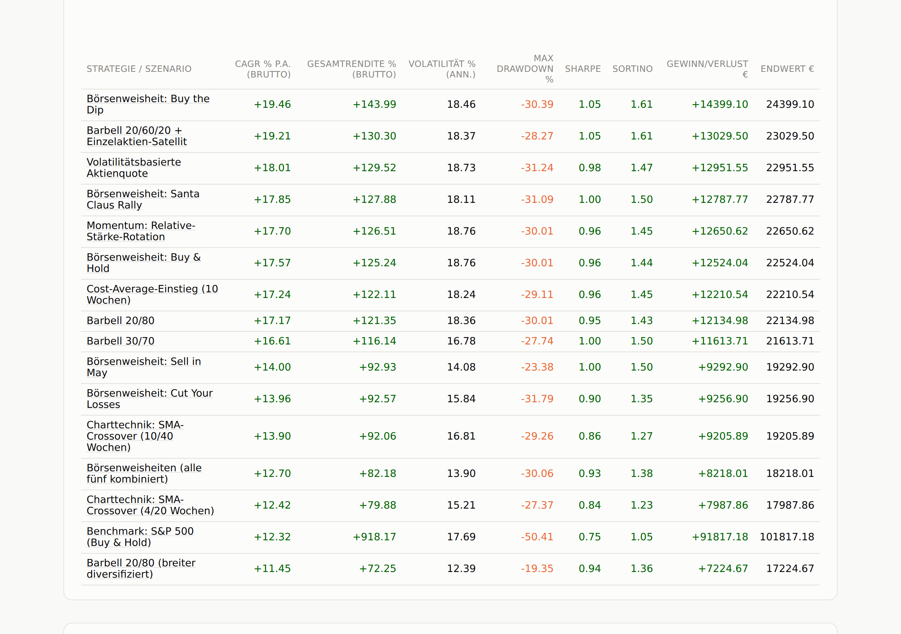

# 🎯 Börsenspiel — Barbell Portfolio Dashboard

[](https://github.com/S540d/Boersenspiel/actions/workflows/ci.yml)
[](https://github.com/S540d/Boersenspiel/actions/workflows/weekly-update.yml)
[](https://s540d.github.io/Boersenspiel/)

**A free, open-source dashboard that backtests 16 different investment
rules against each other — automatically, every week, over the same 20+
years of real market data.** No backend, no signup, no ads: just a static
page rebuilt by GitHub Actions and published on GitHub Pages.

**👉 [See the live dashboard](https://s540d.github.io/Boersenspiel/)**



## Why this exists

Everyone has an opinion on "the right" investing strategy — barbell
allocations, buy-and-hold, sell-in-May, chasing momentum, timing the chart.
This project turns opinions into numbers: the same 24 real instruments (ETFs,
gold, Bitcoin, 10 individual stocks, a benchmark index) run through 5
portfolio strategies and 11 rule-based scenarios, all on **identical**
price history, fees, and German capital-gains tax logic. Whatever
difference shows up in the results comes from the rule alone.

- **📈 5 strategies + 11 scenarios**, compared side by side — from a classic
  20/80 barbell split to a pure S&P 500 benchmark, seasonal rules ("Sell in
  May"), chart signals (SMA crossover), and momentum rotation.
- **🇩🇪 Realistic German tax modeling** — Abgeltungsteuer, Sparerpauschbetrag,
  loss carryforward, Teilfreistellung, Vorabpauschale, and the crypto
  speculation period, not just gross returns.
- **🔁 Fully deterministic & reproducible** — the simulation is a pure
  function of (price history, strategy). Same input, same output, every
  time — no hidden state, no manual bookkeeping.
- **🧠 Self-explaining** — every build re-derives its own "Key Learnings"
  section from the actual results (never a hardcoded claim), and a
  dedicated *Premises* page spells out every assumption, placeholder, and
  known limitation in plain language.
- **🤖 Zero manual maintenance** — prices are fetched weekly via GitHub
  Actions, the dashboard rebuilds and redeploys itself automatically.

Want the full story on *why* a number looks the way it does? The dashboard
explains itself — every detail page has its own methodology notes, and the
**Premises** page (linked from the ⋮ menu on every page) documents the data
basis, tax rules, and everything that is *not* modeled.

## Quickstart

```bash
git clone https://github.com/S540d/Boersenspiel.git
cd Boersenspiel
pip install -r requirements.txt

python scripts/build_dashboard.py   # rebuilds docs/index.html from the bundled price history
open docs/index.html                # or just double-click it
```

Want fresh prices instead of the bundled history? Get a free key at
[alphavantage.co](https://www.alphavantage.co/support/#api-key), export it,
and fetch:

```bash
export ALPHAVANTAGE_API_KEY=...
python scripts/run_fetch.py
python scripts/build_dashboard.py
```

Run the test suite with `pytest -q`.

## Adding your own strategy

New strategies live in `src/boersenspiel/strategies.py` as plain data — a
starting capital, a list of buckets with sub-weights, and a rebalancing
threshold. Add an entry to the `STRATEGIES` list and the dashboard picks it
up automatically, side by side with everything else. Scenarios
(`src/boersenspiel/scenarios.py`) work the same way but add a rule function
that recomputes target weights per week instead of holding them constant.
See the comments in both files for worked examples, or `CLAUDE.md` for the
full architecture writeup.

## Contributing

Issues and pull requests are welcome — whether that's a new strategy, a
data source, a bug fix, or a sharper tax-modeling detail. `CLAUDE.md`
documents the full architecture and every non-obvious design decision if
you want to dig in before changing something.

---

If you find this useful (or just enjoy watching "Buy the Dip" and "Sell in
May" fight it out every week), **a ⭐ on the repo helps other people find
it.**
